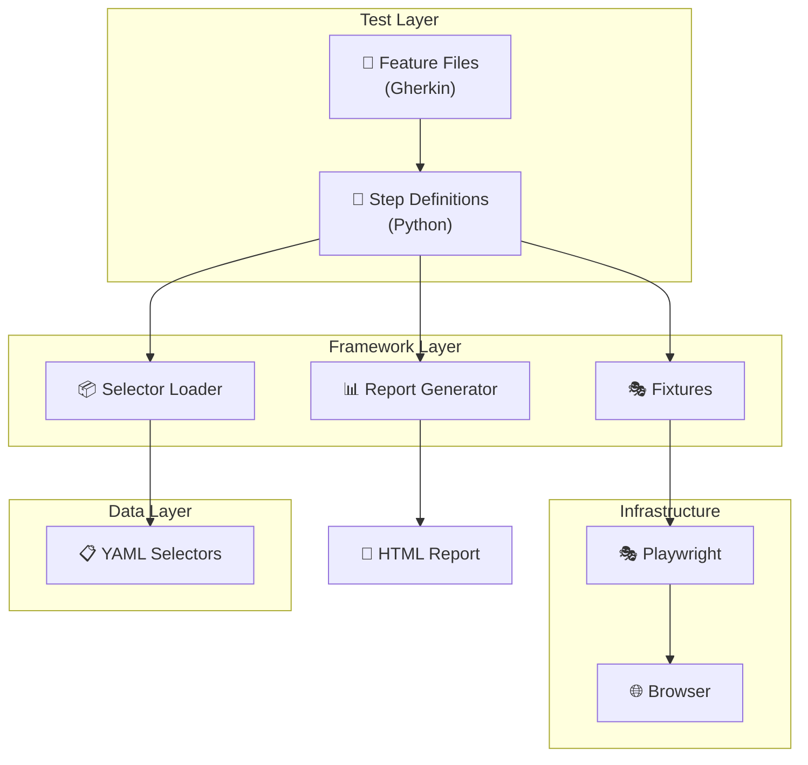
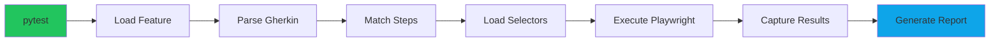
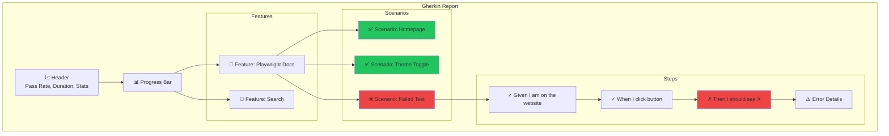

# 🥒 Experiment2 - Python BDD Testing Framework

A Python-based BDD testing framework using **pytest-bdd** and **Playwright** for browser automation. Features YAML-based selector management, Gherkin syntax for test definitions, and cucumber-style HTML reporting.

---

## 📁 Project Structure

```
experiment2/
├── features/           # Gherkin .feature files
│   ├── playwright_docs.feature
│   ├── search.feature
│   └── api_docs.feature
├── steps/              # Step definitions (test implementations)
│   ├── common_steps.py        # Shared Given/When/Then steps
│   ├── test_playwright_docs.py
│   ├── test_search.py
│   └── test_api_docs.py
├── selectors/          # YAML selector files (XPaths in one place)
│   ├── common.yaml           # Reusable selectors
│   └── playwright_docs.yaml  # Page-specific selectors
├── support/            # Framework utilities
│   ├── selector_loader.py    # YAML selector loader
│   ├── fixtures.py           # Playwright fixtures
│   └── gherkin_report.py     # Custom HTML report generator
├── reports/            # Generated test reports
│   ├── gherkin-report.html   # Cucumber-style BDD report
│   └── report.html           # pytest-html report
├── conftest.py         # Pytest configuration & hooks
├── pytest.ini          # Pytest settings
└── requirements.txt    # Python dependencies
```

---

## 🏗️ Architecture



---

## 🔄 Test Execution Flow



---

## 📋 How It Works

### 1. Feature Files (Gherkin Syntax)

```gherkin
# features/playwright_docs.feature
Feature: Playwright Documentation Website

  Scenario: Verify homepage loads correctly
    Given I am on the Playwright website
    Then I should see the page title contains "Playwright"
    And I should see the "Get started" link
```

### 2. Step Definitions

```python
# steps/common_steps.py
@given('I am on the Playwright website')
def go_to_playwright(page):
    page.goto("https://playwright.dev")

@then(parsers.parse('I should see the "{text}" link'))
def verify_link(page, text):
    selector = get_selector('common', 'link', text)
    expect(page.locator(selector).first).to_be_visible()
```

### 3. YAML Selectors

```yaml
# selectors/common.yaml
link: "//a[contains(text(), '{TEXT}')]"
button: "//button[contains(text(), '{TEXT}')]"
heading: "//h1[contains(text(), '{TEXT}')]"
```

### 4. Selector Loader

```python
# Usage: get_selector('common', 'link', 'Get started')
# Returns: "//a[contains(text(), 'Get started')]"
```

---

## 🚀 Commands Reference

### Installation

```bash
# Install dependencies
pip install -r requirements.txt

# Install Playwright browsers
playwright install
```

### Running Tests

| Command | Description |
|---------|-------------|
| `python3 -m pytest` | Run all tests |
| `python3 -m pytest -v` | Run with verbose output |
| `python3 -m pytest --headed` | Run with visible browser |
| `python3 -m pytest -n auto` | Run in parallel (auto workers) |
| `python3 -m pytest -n 4` | Run with 4 parallel workers |
| `python3 -m pytest --headed -n auto` | Parallel + visible browsers |

### Filtering Tests

| Command | Description |
|---------|-------------|
| `python3 -m pytest -k "homepage"` | Run tests matching keyword |
| `python3 -m pytest -k "not failure"` | Exclude tests with keyword |
| `python3 -m pytest -m smoke` | Run tests with marker |
| `python3 -m pytest steps/test_search.py` | Run specific file |
| `python3 -m pytest -m "smoke and not slow"` | Combine markers |

### Browser Options

| Command | Description |
|---------|-------------|
| `python3 -m pytest --browser chromium` | Run in Chrome |
| `python3 -m pytest --browser firefox` | Run in Firefox |
| `python3 -m pytest --browser webkit` | Run in Safari |
| `SLOW_MO=500 python3 -m pytest --headed` | Slow motion (500ms) |
| `SLOW_MO=1000 python3 -m pytest --headed` | Even slower (1s) |

### Viewing Reports

| Command | Description |
|---------|-------------|
| `open reports/gherkin-report.html` | Open BDD report |
| `open reports/report.html` | Open pytest-html report |
| `python3 -m pytest; open reports/gherkin-report.html` | Run + open report |

---

## 📊 Report Structure



---

## 🎯 Markers

Tests can be tagged with markers for selective execution:

```python
@pytest.mark.smoke      # Quick smoke tests
@pytest.mark.theme      # Theme-related tests
@pytest.mark.navigation # Navigation tests
@pytest.mark.search     # Search tests
@pytest.mark.api        # API documentation tests
@pytest.mark.failure    # Intentional failure tests
```

---

## 🔧 Configuration

### pytest.ini

```ini
[pytest]
testpaths = steps
bdd_features_base_dir = features
addopts = -v --tb=short --html=reports/report.html --self-contained-html
```

### Environment Variables

| Variable | Default | Description |
|----------|---------|-------------|
| `SLOW_MO` | `0` | Delay between actions (ms) |

---

## 📦 Dependencies

| Package | Purpose |
|---------|---------|
| `pytest` | Test runner |
| `pytest-bdd` | BDD/Gherkin support |
| `playwright` | Browser automation |
| `pytest-playwright` | Playwright fixtures |
| `pytest-xdist` | Parallel execution |
| `pytest-html` | HTML reports |
| `pyyaml` | YAML selector loading |

---

## 🔄 Adding New Tests

### 1. Create Feature File

```gherkin
# features/my_feature.feature
Feature: My New Feature

  Scenario: Test something
    Given I am on the page
    When I do an action
    Then I should see the result
```

### 2. Add Selectors (if needed)

```yaml
# selectors/my_page.yaml
my_button: "//button[@id='submit']"
my_input: "//input[@name='{TEXT}']"
```

### 3. Create Step Definitions

```python
# steps/test_my_feature.py
from pytest_bdd import scenario, given, when, then
from support.selector_loader import get_selector

@scenario('../features/my_feature.feature', 'Test something')
def test_something():
    pass

@given('I am on the page')
def go_to_page(page):
    page.goto("https://example.com")

@when('I do an action')
def do_action(page):
    page.click(get_selector('my_page', 'my_button'))

@then('I should see the result')
def verify_result(page):
    # assertion here
    pass
```

### 4. Run the Test

```bash
python3 -m pytest -k "test_something" -v
```

---

## 🛠️ Troubleshooting

| Issue | Solution |
|-------|----------|
| Browser not opening | Use `--headed` flag |
| Tests too fast | Set `SLOW_MO=500` |
| Report not updating | Refresh browser (⌘+R) |
| Selector not found | Check YAML file path and key |
| Parallel tests failing | Reduce workers `-n 2` |

---

## 📈 Quick Start

```bash
# 1. Navigate to project
cd experiment2

# 2. Install dependencies
pip install -r requirements.txt
playwright install

# 3. Run tests
python3 -m pytest

# 4. View report
open reports/gherkin-report.html
```

---

## 🎬 Watch Mode (Development)

```bash
# Run single test with visible browser and slow motion
SLOW_MO=500 python3 -m pytest --headed -k "toggle_theme" -v
```

---

*Generated for experiment2 Python BDD Framework*
